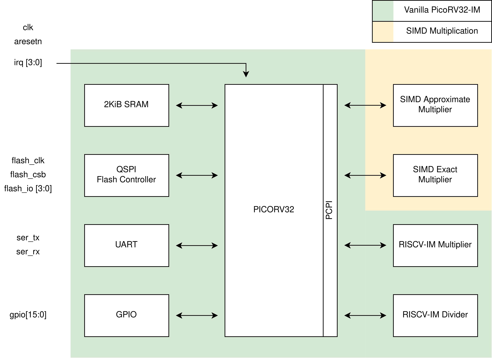
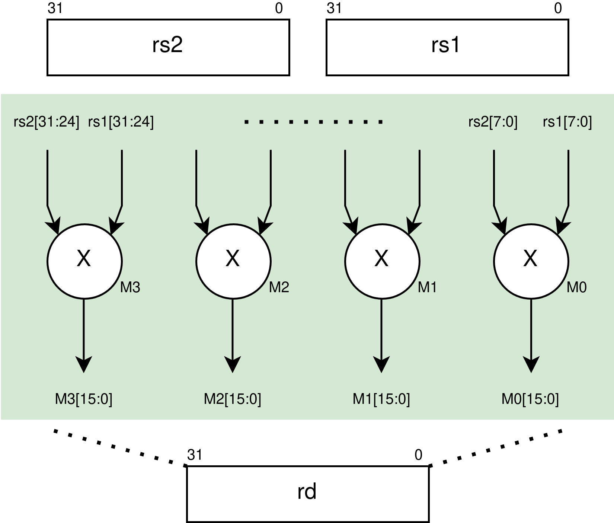
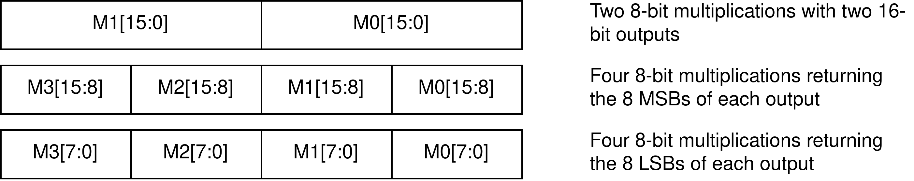
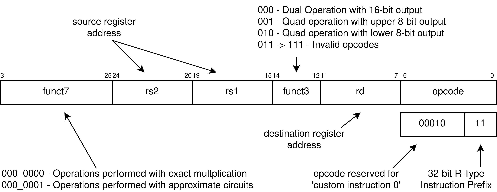
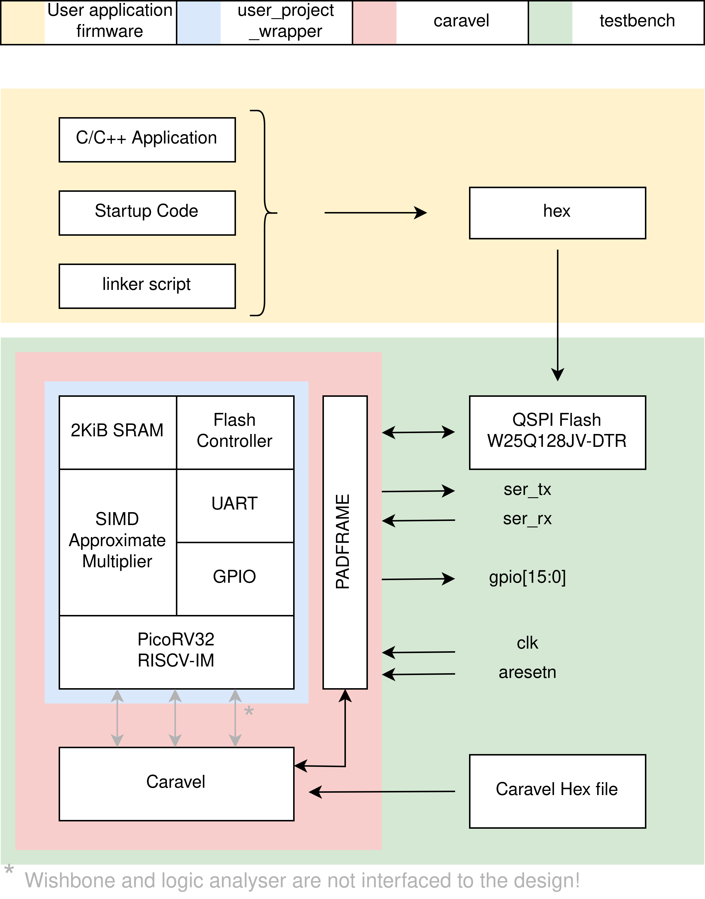
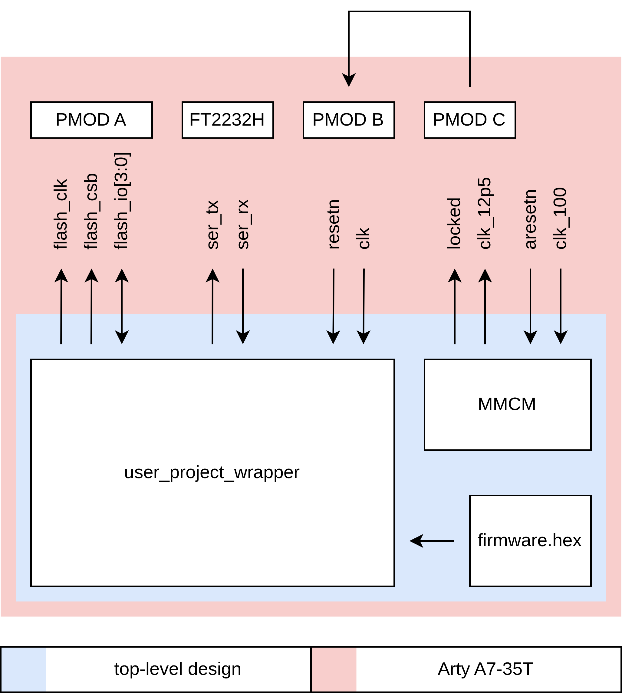
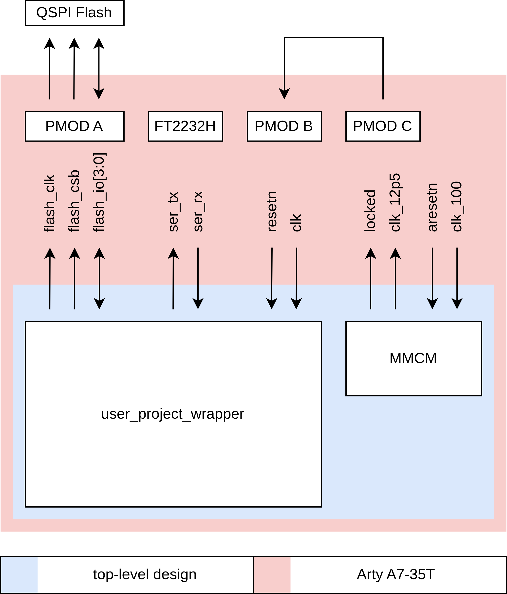
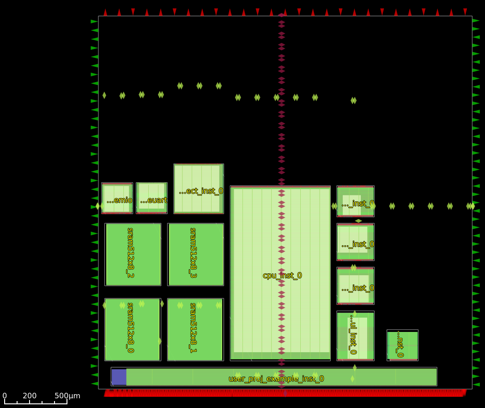
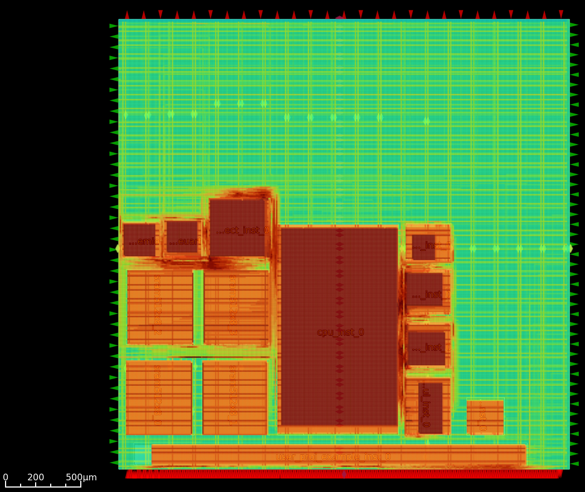

# Picosoc with Approximate SIMD Extension


[toc]

# Overview
This projects extends picosoc with two 8-bit SIMD multpliers each capable of performing four multiplications per instruction. The multpliers are interfaced with the processor via the PCPI port and are accessed with a custom instruction. The architecture of the mulpliers is different, one is exact while the other is approximate. Approximate multipliers trade computational accuary for area, latency and power.

Below is a block diagram of the SoC and the architecture of the SIMD multpliers. 


<figure style="display:inline-block;" >

<figcaption style="text-align:center;"><br>Fig.1 - System on Chip (SoC) block diagram illustrating vanilla picorv32 together with SIMD exact and approximate multiplier extensions.</figcaption>
</figure>

## Integrated Circuit Pinouts

| Pin(s) | Description | Direction |
| --- | --- | --- |
| 7:0 | counter outputs | Output |
| 8   | clock input | Input |
| 9   | active low asynchronous reset | Input |
| 10  | QSPI Flash Chip Select | Output |
| 11  | QSPI Flash Clock | Output |
| 15:12 | QSPI Flash Input/Output | Bi-directional |
| 16  | UART TX | Output |
| 17  | UART RX | Input |
| 21:18 | PICORV Interrupt Request (IRQ) | Input |
| 37:22 | GPIO | Output |

## Memory map

| Address Range | Description |
| --- | --- |
| 0x00000000 .. 0x00FFFFFF | Internal SRAM |
| 0x01000000 .. 0x01FFFFFF | External Serial Flash |
| 0x02000000 .. 0x02000003 | SPI Flash Controller Config Register |
| 0x02000004 .. 0x02000007 | UART Clock Divider Register |
| 0x02000008 .. 0x0200000B | UART Send/Recv Data Register |

# Approximate Computing 
Approximate computing involves sacrificing computational accuracy for gains in speed, power, and area efficiency. Approximate circuits, by utilizing fewer components, may occasionally produce inaccurate outputs, resulting in simpler implementation. This technology finds application in scenarios where a certain degree of error in the output is acceptable, such as video signals intended for human consumption.

# Extension Architecture
The extension modules are nearly identical and only differ in the type of multipliers that are instantiated inside. The exact module uses exact multipliers, while the approximate module uses approximate multipliers [1]. The approximate multipliers have a Mean Error Distance (MED) of 14.25 and a 59.57% probability of generating a correct output. Due to this inaccuracy, the 16-bit output is equivalent to 11.29 bits. In exchange for this loss of accuracy, the circuit is 14% smaller and consumes 10% less energy than its exact counterpart.  All multiplier circuits operate on signed data in two's complement format. 

The two modules are interfaced to [PicoRV32](https://github.com/YosysHQ/picorv32) via the Pico Co-Processor Interface (PCPI) which makes available two input registers, respectively `rs1` and `rs2`, and one output register, `rd`. This section provides a brief description of the module and the setting up of a custom instruction that can perform three operations for each SIMD module for a total of six new instructions.

Figure 2 illustrates the top level architecture of the extension module. The two 32-bit input operands are hardwired to the multipliers, where each one is assigned one byte from the 4-byte input. 


<figure style="display:inline-block;" >

<figcaption style="text-align:center;"><br>Fig.2 - High-level block representation of a SIMD multiplier extension. Two 32-bit registers provide input data is concurrent processed by four multpliers in 8-bit increments.</figcaption>
</figure>

Multiplication can in the worst case generate an output that is twice the size of it's input, which can be problematic since we only have one 32-bit output register. This gives rise to three scenarios which we exploit with three different instructions, With reference to Figure 3, theser are:
- Two 8-bit multiplication are performed using multipliers M0 and M1, packing their 16-bit output into rd.
- Four 8-bit multiplications are performed packing the lower 8-bits of the individual results into rd. 
- Four 8-bit multiplications are performed packing the upper 8-bits of the individual results into rd. 

<figure style="display:inline-block;" >

<figcaption style="text-align:center;"><br>Fig.3 - Illustration of how the individual results of the multpliers are packed into a single 32-bit output register. The number of bits to encode the results of a multiplication is twice that of its operands, therefore we can store two 16-bit results or selectively pack the upper or lower 8-bits from four multiplications. How this is performed is described by a custom instruction.</figcaption>
</figure>

Figure 4 shows the new, R-type instruction defined to access the SIMD modules by passing source operands `rs1` and `rs2` while writing the output to rd. The 7-bit opcode was chosen to be `0x0B` since this is reserved for custom instructions and therefore previously written application code for the picosoc will remain compatible. Whenever this opcode is selected, the instruction will be routed to one of the two SIMD modules, which we determine with the content in the `funct7` field. When `funct7` holds the value of `'7'b0` the SIMD module with exact multipliers operates on the input data. When this field holds `7'b1` the SIMD module with approximate multipliers kicks in. 

Again concerning Figure 4, the contents of `funct3` determine how the results of the multipliers are packed into the destination register `rd`.

<figure style="display:inline-block;" >

<figcaption style="text-align:center;"><br>Fig.4 - Description of a custom R-type RISC V instruction for using the SIMD multiplier extensions. Moving right to left, the first 7-bits consits of the opcode, the next 5-bits selets one of the 32-bit cpu registers for storing the result, the 3-bits of funct3 specify whether a dual/quad operation is performed and how the result is stored, rs1 and rs2 specify two source registers, and funct7 dictates weather the exact or approximate extension is used for calculation.</figcaption>
</figure>

# Reproducing this Work
This project has research applicability in approximate computing. The main goal was to combine scalar processors with custom acceleators and have great flexibility in the design process. For me this means that I can quickly simulate, FPGA test and tape-out an ASIC. This repository offers, in a nutshell:
- Compile assembly or C application code targeting custom PCPI co-processors.
- Simulate the SoC with user application and view detailed waveforms.
- Implement the SoC on a Xilinx SoC using proprietary or open-source toolchain.
- Harden the individual macros (block) using OpenLane. 
- Integrate the macros, perform gate-level simulation and generate GDSII layout files. 

## Application Code
The application code (see yellow block in Figure 5) contains two programs: a) a bootloader and b) a test application that utilises inline assembly to issue custom instructions to the SIMD peripherals. 

## Simulation 
The simulation instantiates the `user_project_wrapper` (without caravel) in a testbench and performs functional/gate-level simulations that reflects real-world operating conditions. A model for an external QSPI flash memory chip is instantiated inside the testbench and the user application code is loaded onto it. The serial port is monitored to capture application output, while all internal signals can be viewed with a viewer such as gtkwave. 

<figure style="display:inline-block;" >

<figcaption style="text-align:center;"><br>Fig.5 - Block diagram of the simulation setup. The yellow block uses RISCV toolchain to compile the user application, the contents of the blue box represent hardware platform build upon picosoc, the red block encapsulates the user's design inside caravel, and finally the green block shows the design in the simulation environment.</figcaption>
</figure>

## FPGA Emulation
*Note: Don't forget to setup the toolchains before running any `make` commands!*

The top-level design, `user_project_wrapper`, is emulated on a small Xilinx FPGA. The on-chip SRAM memory that is implemented using four Global Foundries 512KiB SRAM macros is replaced with a block memory of equivalent size and width, that is 2KiB memory with a 32-bit data bus and 9-bit address bus. Two test implementations are available that facilitate testing:
1. The flash controller is unused and the code is executed from the data memory. This method of operation is obtained by modifying the processor's entry point on reset and subsequently guiding the linker to place program and data sections in data memory.
2. The user application is flashed onto an external QSPI flash and attached to the FPGA via a PMOD connector. 

|     |     |
| --- | --- |
|  |  |
| Fig a) FPGA emulation without external flash memory | Fig b) FPGA emulation with external flash memory |

The two projects are located at `fpga/emulation`. To generate the bitstream simply change into the `fpga` directory and run `make emulation` to build both projects simultaneously:

``` bash
cd fpga
make -j2 emulation
```

### Excluding External Flash (Data Memory is pre-loaded)
To build the project that runs solely from BRAM, use: 
``` bash
cd fpga/emulation/01_wo_external_flash/
make all
```
This generates the bitstream with block ram memory pre-initialised with program code.   

### Full System
Alternatively to build the full project with the external flash: 
``` bash
cd fpga/emulation/02_w_external_flash/
make all
```
Which will generate the bitstream for the design. Note that an external flash memory on PMOD A programmed with the firmaware is required.

## Tapeout with eFabless and GF180 PDK
|     |     |
| --- | --- |
|  |  |
| Fig a) Chip Floorplan showing all macros (see below for detailed description) | Fig b) Chip floorplan overlayed with routing congestion heatmap |

Figure a shows the Chip's floorplan. At the bottom is the macro `user_proj_example` which is the example design that implements a counter controlled by Carvel's PicoRV32 over wishbone and the internal logic analyser. Centre-left are the four 512-byte SRAM cells that collectively provide the processor with 2KiB of memory over a 32-bit bus. At the top left is the flash controller, UART and interconnect that connects the CPU to memory and Input/Output (IO) (flash controller, UART and GPIO). The processor is placed in the centre and is the largest macro in the design. Adjacent to the processor on the right are four PCPI co-processors. starting from the top these are: approximate SIMD multiplier, exact SIMD multiplier, RISCV32-IM Divider and RISCV32-IM Multiplier. The remaining macro on the right contains a reset synchroniser and provides the design with synchronous active-high and active-low reset signals. In Figure b, it is evident that a lot of routing resources are taken in the vicinity of the interconnect and between the CPU and PCPI modules. The shared bus interconnect topology seems to be the cause for this congestion, and is not problematic for this design, because there is plenty of free layout area.

# Toolchain Setup
In this section I briefly describe how to setup the toolchains required for compiling code that is not part of the openlane flow. The toolchains are needed to compile user application firmware and perform FPGA emulation. 

## Risc-V IM toolchain
We need the riscv toolchain with support of the M-extention. Here's how to compile it and make it available on the command line. 
```bash
# Setup some variables
ORIGIN_DIR=${PWD}
INSTALL_DIR=${ORIGIN_DIR}/rv32im

# Obtain the source code
git clone https://github.com/riscv/riscv-gnu-toolchain && cd riscv-gnu-toolchain

# Configure to install the RISCV32-IM toolchain 
mkdir build && cd build
../configure --with-arch=rv32im --prefix=${INSTALL_DIR}/rv32im

# Compile 
make -j$(nproc)

# Install
make install
cd ../../

# Remove the repository (optional)
rm -fr riscv-gnu-toolchain

# Make toolchain available on PATH
export PATH=$PATH:${INSTALL_DIR}

```

## Vivado 2023.1
Please refer to AMD's website to download the [Vitis Unified Toolchain - 2023.1](https://www.xilinx.com/support/download/index.html/content/xilinx/en/downloadNav/vivado-design-tools/2023-1.html) and [UG910 Vivado Design Suite User Guide](https://docs.xilinx.com/r/2023.1-English/ug910-vivado-getting-started) for installation.

After installation don't forget to source the settings script so that xilinx tools are available at the command line (typically they are installed under `/tools` or `/opt`):
```bash
source /tools/Xilinx/Vivado/2023.1/settings64.sh

# verify 
vivado -version
```